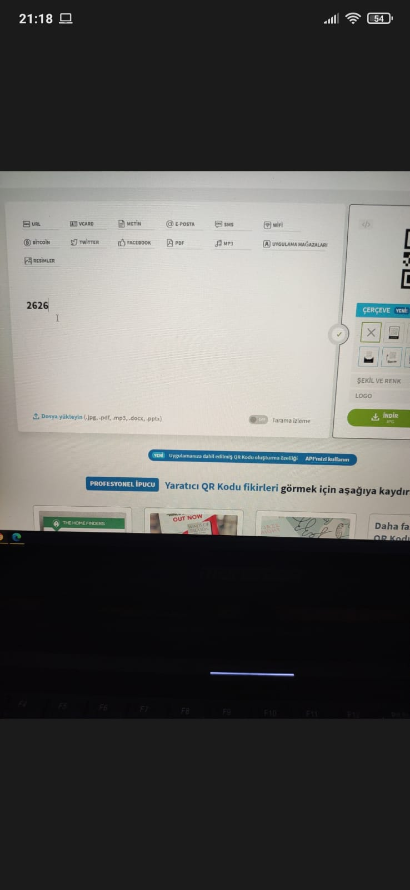
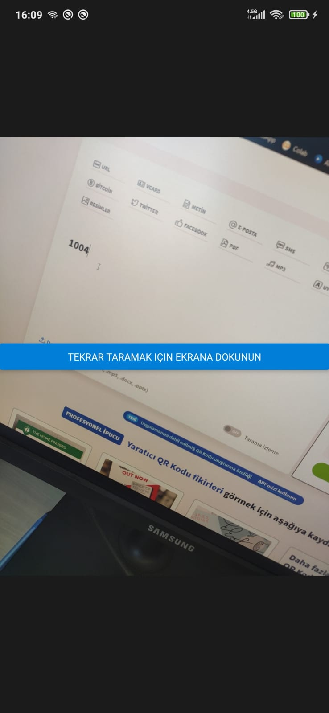
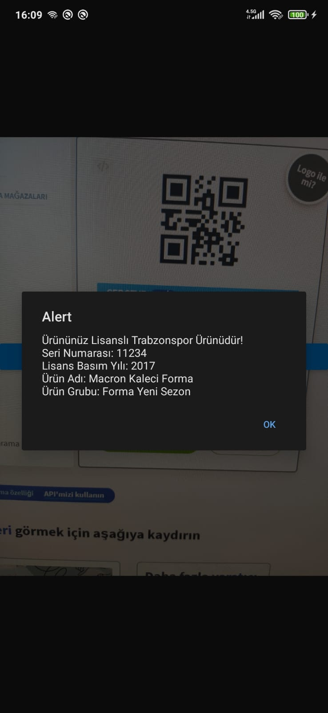
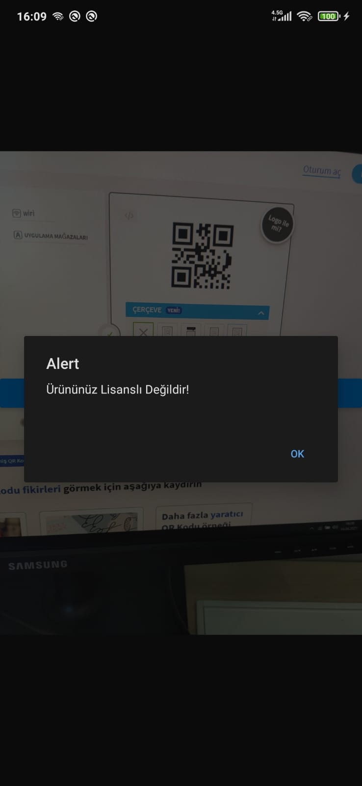

# Trabzonspor Licensed Products QR Scanner Mobile App
A mobile application written in React Native that reads the QR Codes of the products and shows the products information to the user.
It also informs the user whether the product is licensed or not.

